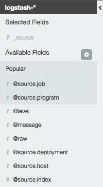
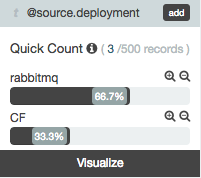
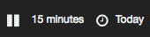
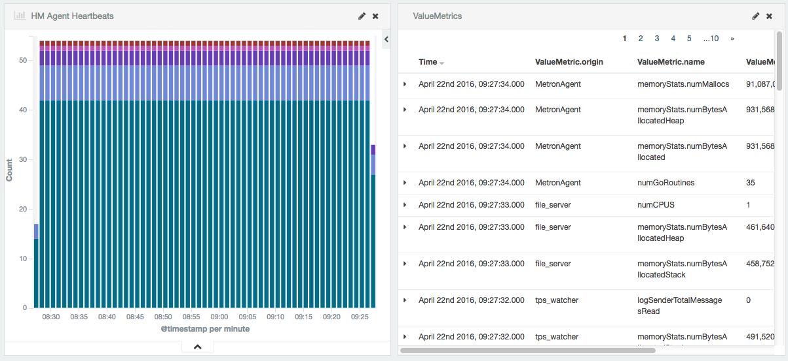

## Finding Logs in the Discover pane

Once everything is setup and logs are being sent to Log Search, you can use the Discover pane within Kibana to access your data and visualize it in meaningful ways.

### The structure of Log Searches data

Log Search receives the raw data from your system in the form of a json of varying size. These can be huge and unwieldy, but can be viewed on the left-hand side of the screen in the [Available Fields](#available-fields) list, and will be listed as **@raw**.

Log Search also parses this data, filters it by keys, adds tags based on information it detects about your system, and adds a time-stamp. Once you understand the way that Log Search structures the information, finding the information you require becomes a matter of filtering via the Discover pane, and using the powerful search and visualization functionality of Kibana.

### The Discover pane

From the main navigation menu of Kibana, click the **Dicover** panel to be taken to the Discover pane.

The Discover pane contains everything you need to access and understand the metrics that is being output by your app and its infrastructure.

#### The Search Results panel

The Search Results pane is the central main area of Kibana that, upon landing on the Discover pane, will be showing all the most recently received logs. The Search Results page will be updated as you filter [Available Fields](#availablefields) or change the [time scale](#changing-the-time-scale) of the returned results.

#### Available Fields

The Available Fields pane is on the left-hand side of the Discover pane, and contains both the Log Search tags and the parsed log keys.

Any item in the Available Fields tab that has the **@** prefix is a tag generated by Log Search, based on and extracted from your data. For more information on the most important tags, see the Available Tags section.

Each Available Field, both tags and log keys, can be used to filter the data in the Search Results area.

To filter by the Available Fields:

1. From the Available Fields List, click the field in which you are interested in filtering by.
1. The Filter list will appear. This is a list of all the values by which you can filter on that particular field.

    

    In the above example, the tag `@source.deployment` has been selected, and the possible values are displayed.

1. To filter all the search results one of the values, for example `rabbitmq`, click the **+** magnifying glass icon. Alternatively, to filter **out** all instances of that value, leaving in all others, click the **-** magnifying glass icon.

1. The Search Results area will be updated accordingly.

#### Time-scale and refresh rate

By default, the time-scale and refresh rate are set to **15 minutes** and **Today**, as you can see when you log on in the top-right hand corner of the Discover pane.

For more information on the these settings and how to change them, please see the Kibana user guide, the correct section of which can be found [here](https://www.elastic.co/guide/en/kibana/current/discover.html#set-time-filter).

#### Using the Search bar

Once you have set up the Available Fields and set your time-scale, you can further refine your search using the Search bar positioned across the top of the Discover pane.

For more information on using the Search bar to further filter your search results, see the [Kibana user guide](https://www.elastic.co/guide/en/kibana/current/discover.html#search).

### Further information about tags

In the Available Fields pane, tags are denoted by a prefixing **@**, and show information that Log Search has extrapolated from the raw data and are considered useful in interpreting the data. These will always be displayed at the top of the Available Fields pane for ease of access.

Some of these are described in more detail below:

* **@timestamp**

    This returns the time that the message was generated. Sometimes a message will be given multiple timestamps - this field will always return the timestamp closest to the time the message was created.

* **@type**

    If the message is a metric, @type determines the type of metric that has been returned. We currently support **CounterEvent**, **ValueMetric**, **LogMessage** and **ContainerMetric**. If none of these is found, the type will always return syslog.

* **@level**

    This always returns 'INFO', 'WARN' or 'ERROR', and defines the urgency of the message.

* **@message**

    This is the full @raw message, including information taken from the syslog header like Time Stamp and source IP.

* **@source.deployment**

    This is taken from the job field, but can not always be determined due to some jobs having the same name on different deployments.

* **@source.host**

    This is, where possible, the IP of the host VM and is taken directly from the syslog headers. If this information is not available, it will instead be a GUID.

* **@source.ip**

    This is the ip of the host VM.

* **@source.job**

    This shows the BOSH deployed job name from which the message was sent.

* **@source.program**

    This is the process within the job from which the message was sent.

* **@source.vm**

    This contains both the BOSH deployed job name and the index of the VM in one field.

## Creating a visualization

Once you have set up a search query that captures the data elements you would like to visualize, save the search from the icons to the right of the search bar.

Click on the Visualize tab from the Kibana navigation menu.

From the screen that appears, select the type of visualization you would like to create. Commonly, Metrics data suits visualizations such as Data table, Line chart or Vertical bar chart, but more information about all of the visualizations can be found [here](https://www.elastic.co/guide/en/kibana/current/visualize.html).

For our example, select a Vertical Bar Chart, and when asked to select a search source, choose **From a saved search**.

Select the search that you just saved: in our example, this is called `hm_agent_heartbeat`.

You will be presented with the Visualize page, and most likely a graph that doesn't display a lot of useful information.

We can change that by changing the X-Axis to date. We do this using the following steps:

1. From the left-hand pane, select the **Add buckets** tab.
1. From the buckets tab that appears, select the **X-Axis** bucket type.
1. From the Aggregation dropdown, select **Date Histogram**
1. From the Field dropdown, select **@timestamp**
1. Keep the Interval to **auto**.
1. Click the **Play** icon in the top-right of the pane to create the visualization.

You should now see the amount of logs (of this type) over time.

We are now going to take this example a little further. This graph shows the amount of logs of this type over time, but it would be more helpful to actually see the graph by the machines emitting these logs.

We can do this by splitting the data into **@source.deployment** type, using the following steps:

1. From the left-hand pane, click the **Add sub-buckets** tab.
1. From the selection that appears, click the **Split Bars** button.
1. A Sub Aggregation dropdown will appear. From this, select **Terms**.
1. This will open further options. From the **Field** dropdown (which may be large), find and select the **@source.deployment** option.
1. Click the **Play** icon in the top-right of the pane to create the visualization.

NOTE: if you do not see all of the deployments that you expect, you can increase the size of the displayed data in the **Order** field in the sub-bucket options. The **Size** must be equal to or more than the number of different machines from which you are receiving logs to ensure all the data is displayed.

If you would like, you can save any visualization that you have created using the save icon in the top-right of the visualization screen. Note that saving it required to use the visualization in a dashboard.

## Creating a Dashboard

A dashboard pane can be used to display and filter simultaneously many visualizations and saved searches. From the top navigation bar, select the **Dashboard** tab.

To get started, click the **New Dashboard** button from the top-right icons, as shown below:

An empty dashboard is created, and the words "Ready to get started?" will be displayed in the centre of the pane. Click the **Add to Dashboard** button, which is shown below:

The Visualizations and Searches search menu appears. In this example, we're going to add the visualization created in the section above, and then a search that we have saved.

1. From the Visualization filter, type "HM Agent Heartbeats", and select the visualization that appears.
1. Click the **Searches** tab, and enter a saved search. In this case, we have entered **ValueMetrics**.
1. These two metrics will be added to your dashboard.

    One advantage that a dashboard provides is allowing filters to affect all the displayed panes. For instance, using the time filter in the top-right will apply your time changes to every displayed visualization and search. Clicking on a bar in a visualization will filter all the panels by that metric.

1. Each visualization and search can also be resized and repositioned via clicking and dragging their title bar and using the arrow in the lower-right corner.

    

1. Any created dashboards can be saved using the save button in the top-right hand side of the dashboard pane.

    

More information on creating a dashboard can be found [here](https://www.elastic.co/guide/en/kibana/current/dashboard.html).
